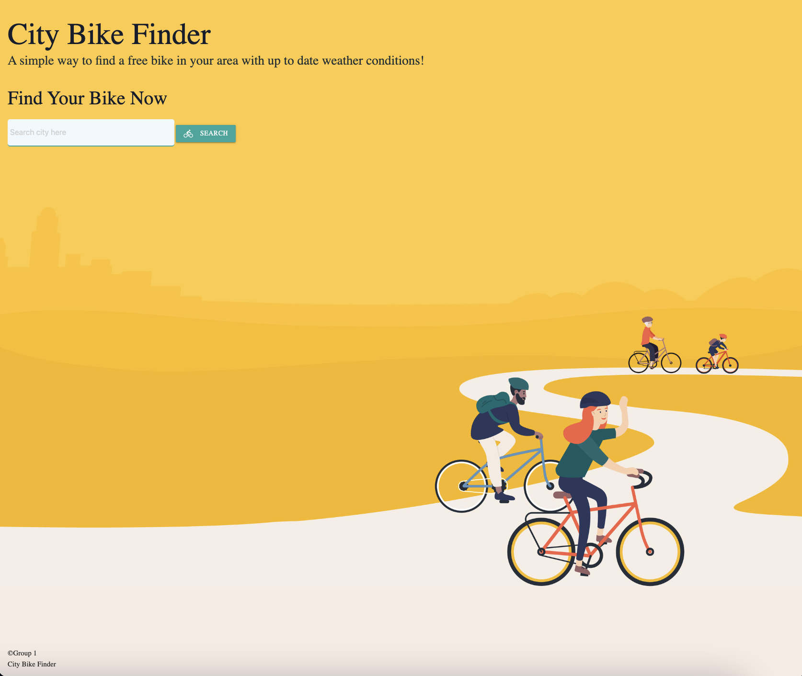

# CityBike Finder 🔍

## Description

CityBike Finder is an  application to search for the closest CityBike locations to the cityt that was searched. Once a location is chosen, the corresponding weather will show as well.

### User Story

As a bike enthusiast 
I WANT to find the nearest CityBike to my location
SO THAT I can ride it
I WANT to be provided with the local weather 
SO THAT I can decide if it’s a good day for biking
I WANT to be able to click on past searches
SO THAT I can easily reference them

#### Criteria:

* Use 2 different API's
* Use a CSS framework other than Bootstrap - we used materialized
* Use client-side storage to store persistent data
* Be  interactive and responsive

###### Rough breakdown of tasks
README - Lindsey
HTML - Cole + Nicole
CSS - Nicole + Cole
JS - Rey + Lindsey

### End Product 
Below are screenshots of various stages of the application.

<!-- screenshots -->

<!-- link -->
### Deployment
Here is the [link](https://) to the live website

### Contributing
- Cole Roberts
- Lindsey Gaughan
- Nicole Pendarvis
- Reynaldo Mendez

